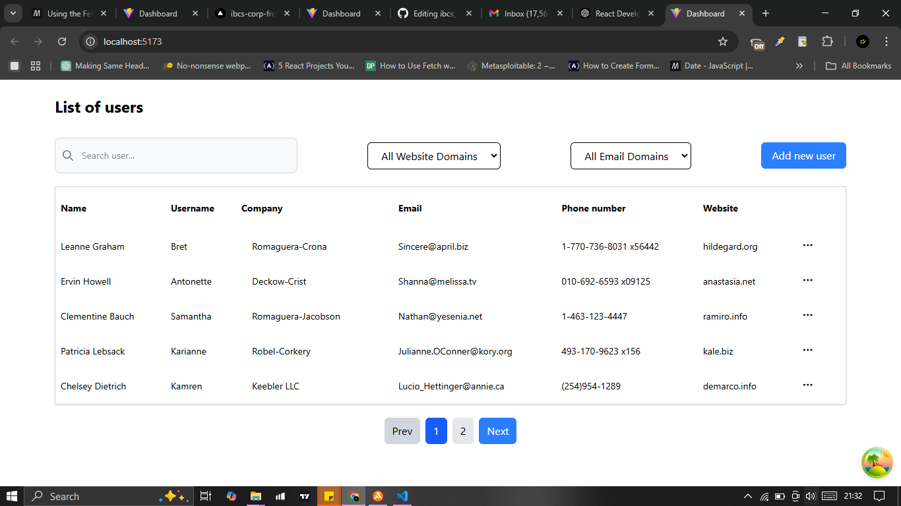

# Mini Dashboard with API Integration

## Project Overview
This project is a React-based mini dashboard that fetches and displays data from an API. It includes sorting, filtering, pagination, and CRUD operations. The app is styled using Tailwind CSS and utilizes TypeScript for type safety.

## Features
### 1. Fetch & Display Data
- Uses JSONPlaceholder API (`/users`).
- Displays data in a responsive table or card format.
- Implements loading and error states.

### 2. Sorting & Filtering
- Users can sort data by different columns (email, website).
- Includes a search input for filtering results.

### 3. Pagination
- Implements client-side pagination.
- Uses Previous and Next buttons for navigation.

### 4. CRUD Operations
- Allows users to edit an item in a modal.
- Implements a delete action with a confirmation prompt.
- Includes a create form to add a new item.

### 5. State Management
- Uses TanStack Query (React Query) for enhanced API handling.

### 6. Optimizations
- Implements debouncing for the search input to prevent excessive re-renders.

### 7. UI & Styling
- Styled using Tailwind CSS.
- Provides a clean and user-friendly interface.

## Screenshot


## Installation & Setup
### Prerequisites
- Node.js (>=14.x)
- npm or yarn

### Steps
1. Clone the repository:
   ```sh
   git clone https://github.com/egba001/ibcs_corp_frontend_assessment.git
   ```
2. Navigate to the project folder:
   ```sh
   cd react-mini-dashboard
   ```
3. Install dependencies:
   ```sh
   npm install
   # or
   yarn install
   ```
4. Start the development server:
   ```sh
   npm run dev
   # or
   yarn dev
   ```
5. Open [http://localhost:5173](http://localhost:5173) in your browser.

## Usage
- Sort data by clicking on column headers.
- Use the search bar to filter results.
- Navigate using pagination controls.
- Edit, delete, or add new items via the provided UI.

## Tech Stack
- **React (TypeScript)**
- **Tailwind CSS**
- **React Query**
- **JSONPlaceholder API**

## Folder Structure
```
react-mini-dashboard/
├── src/
│   ├── components/       # Reusable components 
│   ├── utils/            # Utility functions
│       ├── api.ts        # API calls
│       ├── hooks.ts      # Custom hooks
│       ├── types.ts      # TypeScript interfaces
│   ├── App.tsx           # Main App component
│   ├── main.tsx          # Entry point
│
├── public/               # Static assets
├── package.json          # Dependencies & scripts
├── README.md             # Project documentation
```

## Future Improvements
- Implement authentication.
- Add dark mode support.
- Improve UI with Material UI components.

## License
This project is open-source and available under the MIT License.

---

Happy coding! 🚀
